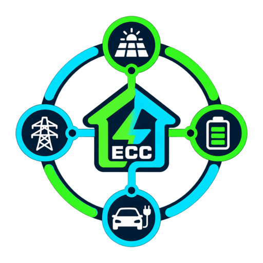

# Energy Command Centre

  

Energy Command Centre (ECC) is an independent Home Assistant energy dashboard that connects directly to supported inverter hardware over the local network. GivEnergy is the first family being implemented in depth, using the inverter/data-adapter IP as the source of truth for inverter, solar, grid, house and battery data.

> Early alpha: the current direct-control work is read-only. ECC does not write inverter settings in this phase.

## Installation

See the complete **[installation guide](INSTALL.md)** for HACS, manual installation, updating and troubleshooting.

## Direct local data

ECC no longer needs GivTCP-created entities to obtain its primary energy data. During setup you enter the inverter IP address and ECC connects locally using the GivEnergy Modbus interface on port `8899` by default.

Where the connected model exposes the information, ECC can read:

- inverter model, serial, firmware, status, temperatures, faults and warnings
- live PV generation and per-string voltage/current/power
- live house/load power
- live grid import/export, voltage, current and frequency
- live battery charge/discharge, SOC, voltage, current and temperature
- attached battery count and per-battery information
- battery capacity, cycle count, BMS firmware and cell voltages where exposed
- daily solar, consumption, grid import/export and battery charge/discharge totals
- lifetime generation/import/export and battery totals where exposed
- read-only raw plant diagnostics for troubleshooting and compatibility work

Unsupported fields are shown as unavailable rather than being guessed from unrelated Home Assistant sensors.

## Dashboard and navigation

ECC keeps its large visual house dashboard as the default page and uses an app-style sidebar for deeper information:

- **Dashboard** — visual house overview and live power flows
- **Battery Centre** — battery-bank and per-battery detail
- **Inverter Details** — inverter, PV and electrical information
- **Diagnostics** — connection health, faults, warnings and stale/offline state
- **Register Data** — read-only detailed/raw data for troubleshooting
- **Settings & Support** — configuration information and optional support links

The backing house scene remains separate from all live overlays. EV display remains optional and the selected EV setting controls whether the car/EV elements are shown.

## Completely free

Energy Command Centre is free to use. There is no £2.99 tier, premium subscription or feature gating. All supported monitoring and diagnostic features are available to everyone.

If you find ECC useful and want to support future development, donations are optional:

- [Ko-fi](https://ko-fi.com/ady1984)
- [Buy me a beer](https://paypal.me/graffidoodle)

## Planned

- broader GivEnergy model/topology coverage and automatic local discovery
- native Home Assistant sensor entities generated from the direct inverter snapshot
- safe opt-in inverter controls and schedules after read-only monitoring is stable
- PredBat plan visualisation and explanations
- Octopus tariff and Intelligent Go support
- Hypervolt/EV charging information and controls
- historical battery-cell analysis and anomaly detection
- notifications, guided fixes and advanced reports
- additional inverter manufacturer drivers behind the same normalised data model

## Development installation

1. Copy `custom_components/energy_command_centre` into the `custom_components` directory in your Home Assistant configuration.
2. Restart Home Assistant.
3. Open **Settings → Devices & services → Add integration**.
4. Search for **Energy Command Centre**.
5. Enter the local IP address of the GivEnergy inverter/data adapter. Leave the port at `8899` unless your setup uses a different port.
6. ECC validates the device, detects the inverter serial/model and creates the integration.
7. Open **Energy Hub** from the Home Assistant sidebar.

ECC communicates locally with the inverter. Normal operation does not require the GivEnergy cloud.

## Independence

This community project is not affiliated with or endorsed by Home Assistant, HACS, GivEnergy, INVLocal, any inverter/battery/charger manufacturer, or any energy supplier. Product names are used only to describe compatibility.

## Licence

Released under the MIT License. See `LICENSE`.
